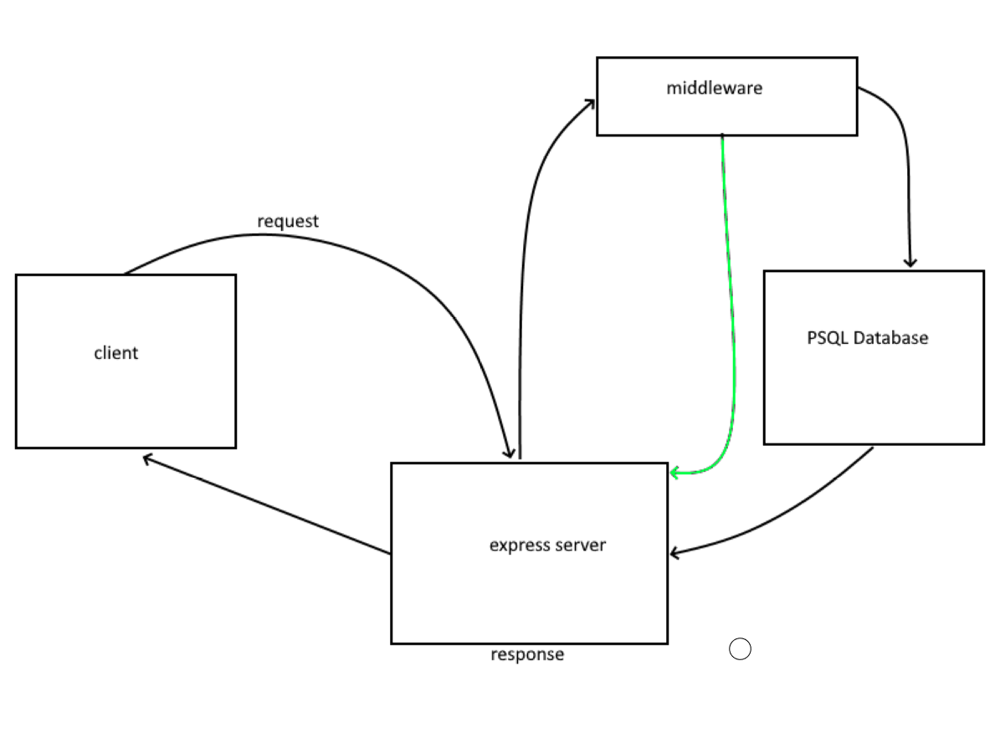

# basic-auth
created by dario v

## Description
Authentication System Phase 1: Deploy an Express server that implements Basic Authentication, with signup and signin capabilities, using a Postgres database for storage.

## Version
1.0.0

## link to deployed site

[Heroku](https://basicauth-server.herokuapp.com/)

## uml

